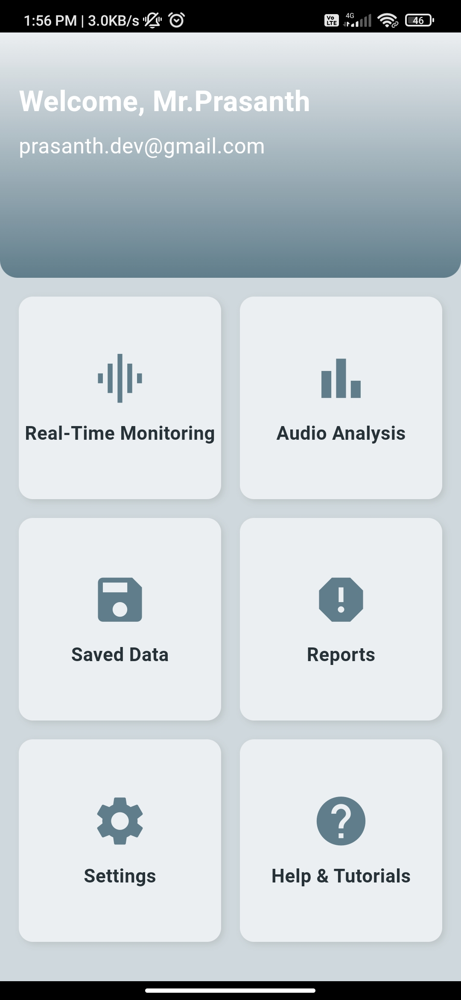
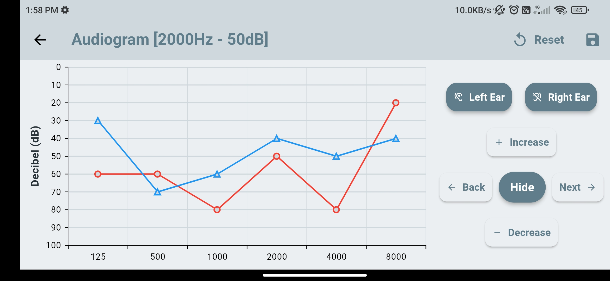
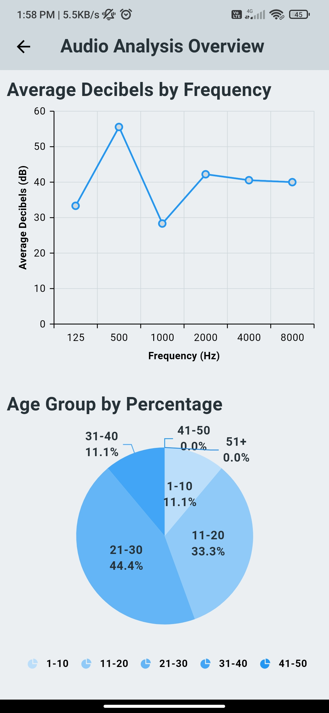
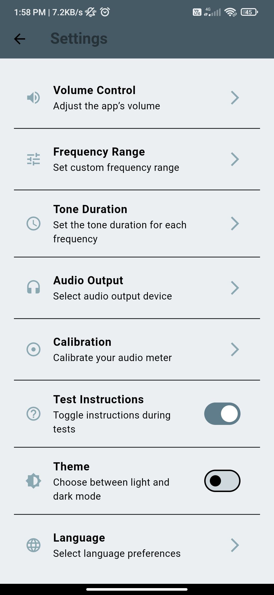
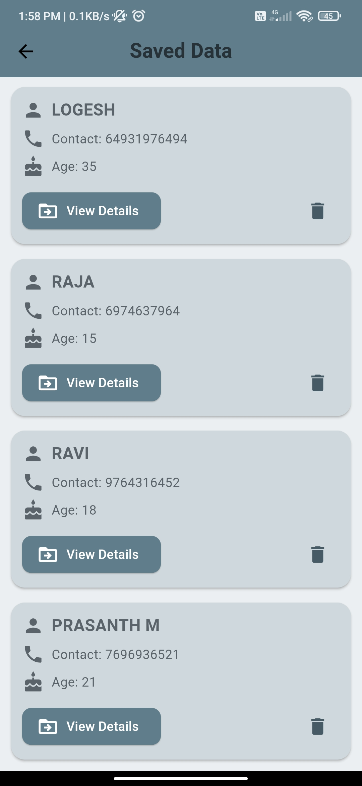

# App-Based Digital Audio Meter


**An advanced, technical, and feature-rich app for real-time audio measurement and analysis, built with Flutter.**

---

## Overview

The **App-Based Digital Audio Meter** is a Flutter application designed for audio professionals and enthusiasts. It offers precise real-time monitoring and visualization of audio signals, making it a valuable tool for sound engineering and analysis tasks.

---

## Features

- **Real-Time Audio Monitoring**: Dynamic visualization of sound waves and decibel levels.
- **Customizable Settings**: Configure parameters like frequency range and sensitivity.
- **Data Logging**: Save and export audio logs for further analysis (CSV and PDF formats supported).
- **Professional UI**: Designed with a polished, intuitive interface for seamless user experience.
- **Cross-Platform**: Fully functional on both Android and iOS devices.
- **Responsive Design**: Optimized for screens of various sizes with gradient-based visuals.

---

## Core Technologies

- **Flutter**: For crafting a high-quality, cross-platform user interface.
- **Dart**: Provides efficient backend logic and state management.
- **Firebase**:
  - **Firestore**: For storing configurations and audio logs.
  - **Realtime Database**: For live audio monitoring and data handling.
- **Provider**: Simplifies state management across the application.

---

## Functionality

### **Audio Signal Input**
- Captures audio signals using the device's built-in microphone.

### **Real-Time Processing**
- Processes incoming signals dynamically to calculate decibel levels and generate visual graphs.

### **Graphical Visualization**
- Displays processed audio data in an intuitive graphical format.

### **Data Logging**
- Enables users to log measurements for review or export them for external use.

---

## Usage Flow

1. **Launch the App**:
   - Grant microphone permissions for audio capture.

2. **Start Monitoring**:
   - Begin real-time monitoring and visualization of audio signals.

3. **Adjust Settings**:
   - Navigate to the settings menu for customization as per your needs.

4. **Log and Export Data**:
   - Save logs and export them in preferred formats for professional use.

---
## Screenshots

**Add your screenshots by uploading images to the repository and replacing `#` with the image paths.**

### **Home Screen**:


### **Real-Time Monitoring**:


### **Audio Visualization**:


### **Settings Menu**:


### **Data Logging**:


---


## Future Enhancements

- **External Audio Device Support**: Compatibility with external devices for enhanced accuracy.
- **Advanced Signal Processing**: For professional-grade audio engineering tasks.
- **Cloud Backup**: Store logs and configurations securely in the cloud.
- **Multilingual Support**: Expand usability for a global audience.

---

## Steps to Run

1. **Clone the Repository**
   ```bash
   git clone https://github.com/prasanth8961/audiometer.git
   cd audiometer

## Steps to Run
1. Clone the Repository
   ```bash
   git clone https://github.com/prasanth8961/audiometer.git
   cd audiometer
2. Install Flutter SDK
   link flutter installation Guide
   ```bash
   flutter doctor
3. Install Dependencies
   ```bash
   flutter pub get
4. Set up a Device
   # Physical Device: Connect your Android or iOS device via USB and enable Developer Mode.
   # Emulator: Set up an Android or iOS emulator in Android Studio or Xcode.
5. Run the App
    ```bash
   flutter run

6. Interact with the App
    # Launch the app and grant microphone permissions.
    # Start real-time monitoring of audio levels.
    # Adjust settings from the menu to fit your preferences.
    # Log audio data for future analysis.
    # Export logs in CSV or PDF format for external use.

  


## Contributing

Contributions are welcome to improve the project.

1. Fork the repository.
2. Create a new branch for your feature:
   ```bash
   git checkout -b feature/feature-name


License
This project is licensed under the MIT License.

For queries or support, please contact prasanth.appdev@gmail.com

Made with ❤️ by Prasanth
